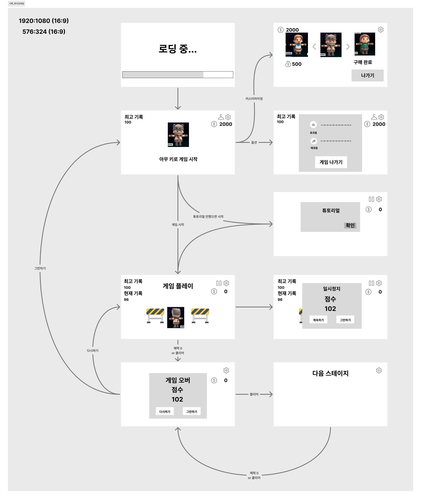
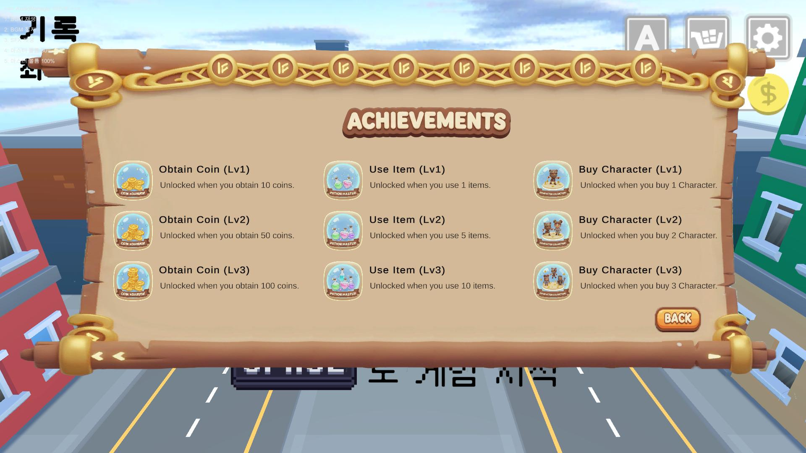
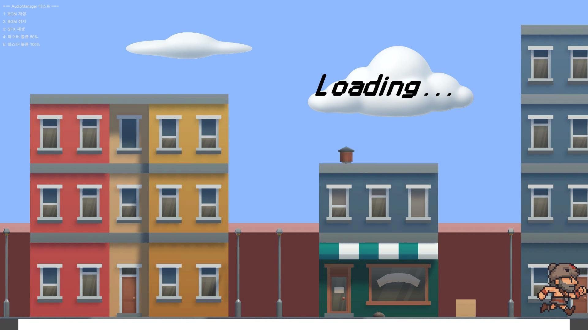

# ThreadRun

---

## 📑 목차

- [발표 자료 & 문서](#발표-자료--문서)
- [프로젝트 개요](#프로젝트-개요)
- [프로젝트 설명](#프로젝트-설명)
  - [1. Tech Stack](#1-tech-stack)
  - [2. 와이어프레임](#2-와이어프레임)
- [기능 설명](#기능-설명)
  - [1. 캐릭터](#1-캐릭터)
  - [2. 맵](#2-맵)
  - [3. 충돌 처리](#3-충돌-처리)
  - [4. 상점](#4-상점)
  - [5. 업적](#5-업적)
  - [6. 튜토리얼](#6-튜토리얼)
  - [7. 로딩 씬](#7-로딩-씬)
- [트러블슈팅](#트러블슈팅)

---

## [발표 자료 & 문서]

- [PPT (Google Slide)](https://docs.google.com/presentation/d/1gX0cmWSwRL__9r7DIlhT5A_V4X4Zgh1L2HGvngP8aHA/edit?usp=sharing)
- [Figma](https://www.figma.com/embed/interstitial?embed_host=notion&embed_path=%2Fdesign%2FbHepgffXRgt0oKv4IvhP9q%2F%2525EA%2525B2%25258C%2525EC%25259E%252584-%2525EA%2525B0%25259C%2525EB%2525B0%25259C-%2525EC%252588%252599%2525EB%2525A0%2525A8%3Fembed-host%3Dnotion%26footer%3D0%26kind%3Dfile%26node-id%3D0-1%26page-selector%3D1%26theme%3Dsystem%26version%3D2%26viewer%3D1&theme=system&version=2)

## [프로젝트 개요]

| 항목       | 내용                             |
| ---------- | -------------------------------- |
| 프로젝트명 | ThreadRun                        |
| 주제       | 3d 달리기                        |
| 개발 인원  | 총 5명 (개발자)                  |
| 개발 기간  | 2025.11.14 ~ 2025.11.21 (총 7일) |
| 개발 목적  | Unity 3d 실습                    |

## [프로젝트 설명]

### 1. Tech Stack

| 구분            | 기술                                                                                                                  |
| --------------- | --------------------------------------------------------------------------------------------------------------------- |
| Language        |                   |
| Framework       |                   |
| IDE             |  |
| Version Control |                 |
| Design          |                   |
| Documentation   |                 |

---

### 2. 와이어프레임

---

## [기능 설명]

### 1. 캐릭터

- 움직임
  - 이동 (AD)
  - 점프, 이단 점프 (Space)
  - 슬라이딩 (Control)
- 애니메이션 적용

### 2. 맵

- 배경 무한 생성
  - LastPivot, DeadZone을 통해 맵 무한 생성

- 장애물 충돌

### 3. 충돌 처리

- 장애물과 충돌처리

### 4. 상점

- 캐릭터 선택, 구매
- 캐릭터 커스터마이징

### 5. 업적

- 업적 기능

### 6. 튜토리얼

- 튜툐리얼

### 7. 로딩 씬

## [트러블슈팅]

> 개발 중 발생한 주요 이슈 및 해결 과정을 정리했습니다.  
> 각 항목은 별도 TIL 또는 블로그 포스트로 링크됩니다.

| 주제                   | 해결 요약                                      | 링크     |
| ---------------------- | ---------------------------------------------- | -------- |
| 파괴된 오브젝트에 접근 | 사용하기 전에 NULL 체크하고 캐싱하기           | [🔗 -]() |
| 태그 오류              | GameManager에서 타입으로 탐색 및 캐싱하여 사용 | [🔗 -]() |

---
